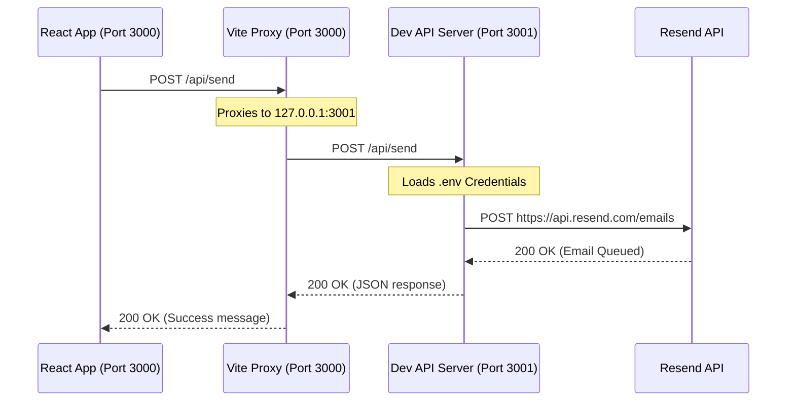

# Developer & Onboarding Guide

Welcome to the project! This guide is designed to help you quickly understand the project architecture, set up your local development environment, troubleshoot common problems, and safely add new features.

---

## 📂 Project Architecture

This application is built as a hybrid stack consisting of:
1. **Frontend:** A modern single-page React app bundled with **Vite** (located under `src/`).
2. **Backend Serverless API:** A serverless function handler located under `api/` that executes on Vercel to handle API endpoints (such as sending emails via Resend).
3. **Local API Proxy:** A local Node.js server (`dev-api.js`) that mimics Vercel's serverless environment for offline development.

---

## 🛠️ Local Development Setup

To test the application locally (including form submissions), you need to run both the frontend dev server and the backend proxy server simultaneously.

### 1. Configure Environment Variables
Create a file named `.env` in the root of your project directory (this file is gitignored to secure secrets):
```env
# Resend Configuration
RESEND_API_KEY=your_resend_api_key_here
TO_EMAIL=your_recipient_email_address@gmail.com
```

### 2. Run Both Servers
Start the dev setup by running:
```bash
npm run dev:all
```
This runs the `concurrently` utility which starts:
* **Frontend server** on http://localhost:3000
* **Backend API server** on http://127.0.0.1:3001

---

## ✉️ How Email Sending Works

The contact form submissions flow through a proxy architecture to protect secrets and ensure compatibility between local development and production.



### Sandbox Limitations (Free Tier)
While using Resend's free onboarding plan:
1. The **Sender (`from`)** must be exactly: `Portfolio Contact Form <onboarding@resend.dev>`.
2. The **Recipient (`to`)** must be set to the email address used to register the Resend account. Sending to arbitrary addresses will fail with a `403 Forbidden` error unless you verify your domain or add a payment card in Resend.
3. Sandbox emails are frequently marked as **Spam** by Gmail/Yahoo. Always check your **Spam / Junk** folder when testing!

---

## 📝 Common Modification Tasks

### 1. Adding/Editing Project Listings
Open [src/components/Projects.jsx](file:///Users/chiragsharma/Downloads/chiragsharmadev/src/components/Projects.jsx). Near the top, modify the `projects` array:
```javascript
const projects = [
  { 
    title: 'New Project Name', 
    type: 'External / Personal Project', 
    images: ['/image1.png', '/image2.png'] // Place screenshots in /public folder
  },
  // ...
];
```

### 2. Modifying Page Routing & Proxy Rules
* **Vite Proxy:** If you add more API endpoints, make sure they are covered by the `/api` glob in [vite.config.js](file:///Users/chiragsharma/Downloads/chiragsharmadev/vite.config.js).
* **Vercel Routes:** Open [vercel.json](file:///Users/chiragsharma/Downloads/chiragsharmadev/vercel.json) to update path rewrites. The current configuration excludes `/api/` from being rewritten to `index.html`.

---

## 🔍 Troubleshooting Guide

### ❌ `ECONNREFUSED` / proxy connection error
* **Symptom:** Submitting the form fails, and your console logs an `ECONNREFUSED` error pointing to `127.0.0.1:3001`.
* **Cause:** The local backend server (`dev-api.js`) is not running.
* **Fix:** Ensure you start the servers using `npm run dev:all` rather than just `npm run dev`.

### ❌ IPv6 Loopback Connection Issues (`502 Bad Gateway`)
* **Symptom:** You receive a `502 Bad Gateway` from Vite when calling `/api/send`.
* **Cause:** Vite is attempting to connect to the backend server using an IPv6 address (`[::1]`) instead of IPv4 (`127.0.0.1`).
* **Fix:** We resolved this by explicitly binding the proxy configuration in `vite.config.js` and the listener in `dev-api.js` to `127.0.0.1` instead of `localhost`. Always stick to explicit IPs for local network boundaries on macOS.

---

## 🚀 Production Deployment (Vercel)

When deploying to Vercel, Vercel automatically runs the serverless function handler located in `api/send.js`.

1. **Add Env Variables:** In the Vercel dashboard, navigate to **Settings** -> **Environment Variables** and add:
   * `RESEND_API_KEY` (Your live API key)
   * `TO_EMAIL` (Your designated recipient address)
2. **Deploy:** Deploy the repository. Vercel automatically maps the `api/send.js` file to host path `/api/send` and utilizes `vercel.json` routing rules to bypass SPA redirects.
